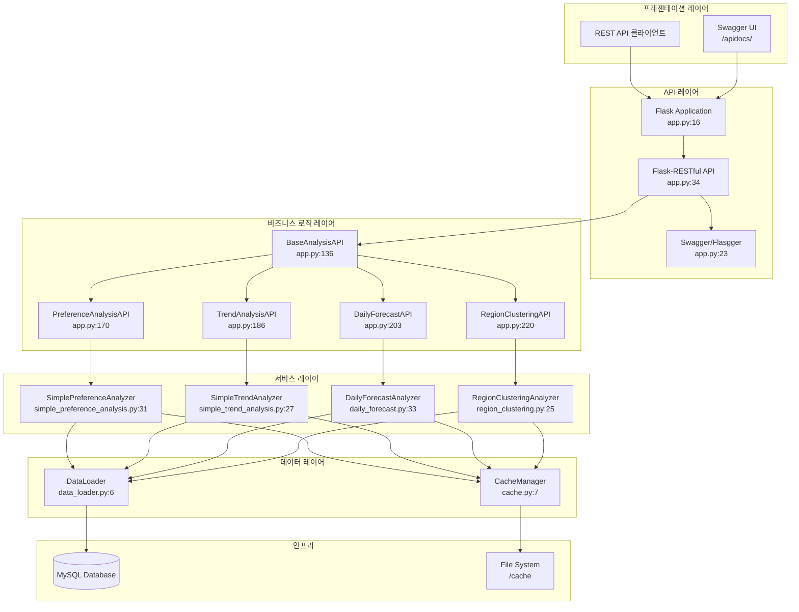
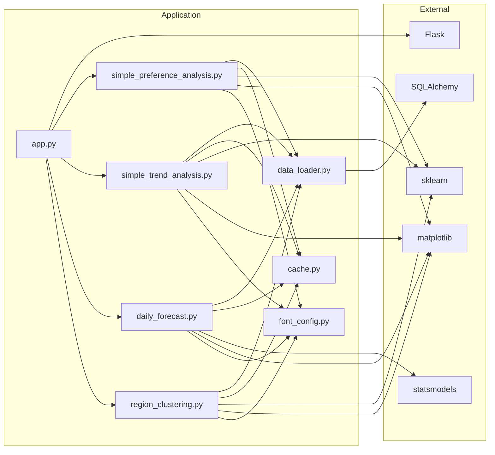
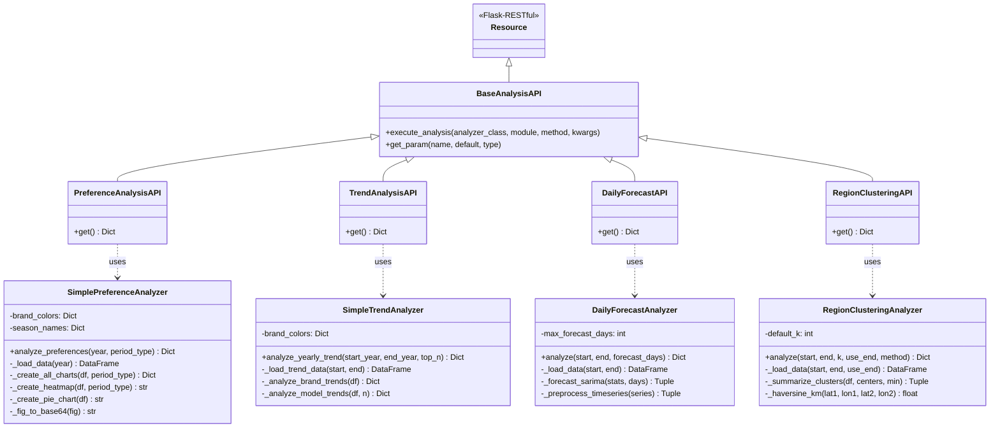
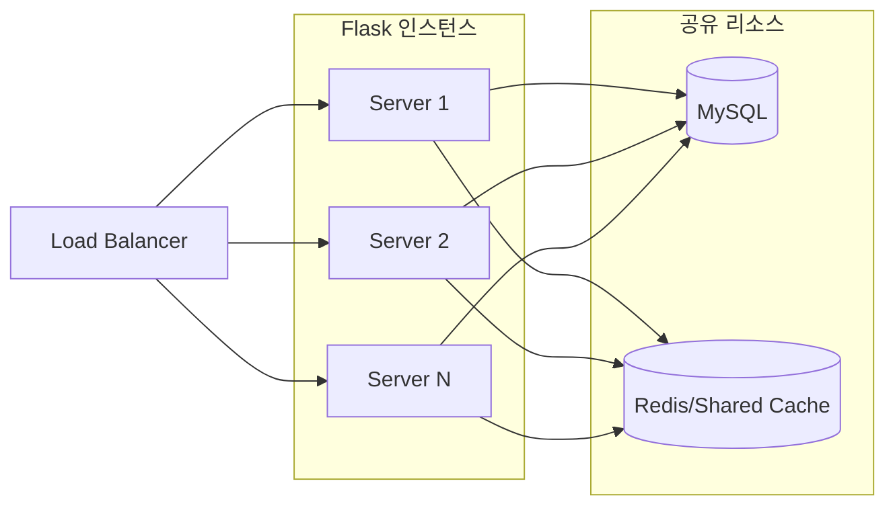

# 시스템 아키텍처

> KUNI 2thecore 데이터 분석 시스템의 전체 아키텍처 및 컴포넌트 구조

## 아키텍처 개요



## 레이어별 상세 설명

### 1. 프레젠테이션 레이어

사용자와 시스템 간의 인터페이스를 제공합니다.

| 컴포넌트 | 설명 |
|----------|------|
| REST API 클라이언트 | curl, Postman 등 HTTP 클라이언트 |
| Swagger UI | 대화형 API 문서 및 테스트 인터페이스 |

### 2. API 레이어

HTTP 요청/응답을 처리하고 라우팅을 담당합니다.

**주요 파일**: [app.py](../app.py)

```python
# app.py:16-34 - Flask 앱 초기화
app = Flask(__name__)
app.config["SWAGGER"] = {
    "title": "KUNI 2thecore Data Analysis API",
    "uiversion": 3
}
swagger = Swagger(app)
CORS(app)
api = Api(app)
```

#### 등록된 엔드포인트
```python
# app.py:240-246 - 엔드포인트 등록
api.add_resource(DataAnalysisAPI, '/')
api.add_resource(DataQueryAPI, '/api/data')
api.add_resource(HealthCheckAPI, '/api/health')
api.add_resource(PreferenceAnalysisAPI, '/api/analysis/period')
api.add_resource(TrendAnalysisAPI, '/api/analysis/trend')
api.add_resource(DailyForecastAPI, '/api/forecast/daily')
api.add_resource(RegionClusteringAPI, '/api/clustering/regions')
```

### 3. 비즈니스 로직 레이어

API 요청을 처리하고 서비스 레이어와 연동합니다.

#### BaseAnalysisAPI (공통 패턴 추상화)
**위치**: [app.py:136-166](../app.py#L136-L166)

```python
class BaseAnalysisAPI(Resource):
    """분석 API들의 공통 패턴을 처리하는 베이스 클래스"""

    def execute_analysis(self, analyzer_class, analyzer_module, method_name='analyze', **kwargs):
        """공통 분석 실행 패턴"""
        # 동적 임포트 및 분석기 인스턴스 생성
        module = __import__(analyzer_module, fromlist=[analyzer_class])
        analyzer_cls = getattr(module, analyzer_class)
        analyzer = analyzer_cls()
        method = getattr(analyzer, method_name)
        return method(**kwargs)

    def get_param(self, param_name, default=None, param_type=str):
        """파라미터 추출 및 타입 변환 헬퍼"""
        # ...
```

**설계 패턴**: Template Method Pattern
- 모든 분석 API가 동일한 실행 패턴을 따름
- 동적 임포트로 서비스 레이어와 느슨한 결합 유지

### 4. 서비스 레이어

핵심 비즈니스 로직과 분석 알고리즘을 구현합니다.

| 클래스 | 파일 | 주요 기능 |
|--------|------|-----------|
| `SimplePreferenceAnalyzer` | [simple_preference_analysis.py:31](../src/simple_preference_analysis.py#L31) | 계절/월별 선호도 분석 |
| `SimpleTrendAnalyzer` | [simple_trend_analysis.py:27](../src/simple_trend_analysis.py#L27) | 연도별 트렌드 분석 |
| `DailyForecastAnalyzer` | [daily_forecast.py:33](../src/services/daily_forecast.py#L33) | SARIMA 기반 예측 |
| `RegionClusteringAnalyzer` | [region_clustering.py:25](../src/services/region_clustering.py#L25) | K-means/DBSCAN 클러스터링 |

#### 공통 패턴
모든 Analyzer 클래스는 다음 패턴을 따릅니다:

```python
class XxxAnalyzer:
    def __init__(self):
        # 초기화 설정
        pass

    @cache_result(duration=1800)  # 30분 캐싱
    def analyze(self, **params) -> Dict[str, Any]:
        """메인 분석 메서드"""
        df = self._load_data(...)     # 1. 데이터 로드
        results = self._process(df)    # 2. 분석 수행
        charts = self._visualize(...)  # 3. 시각화 생성
        return {
            "success": True,
            "visualizations": charts,
            "data": results
        }

    def _fig_to_base64(self, fig) -> str:
        """Figure를 base64로 변환"""
        # 모든 차트는 base64 인코딩된 JPEG로 반환
```

### 5. 데이터 레이어

데이터베이스 연결과 캐싱을 담당합니다.

#### DataLoader
**위치**: [src/data_loader.py](../src/data_loader.py)

```python
# data_loader.py:6-22 - DB 연결
def get_db_connection():
    """SQLAlchemy 엔진 생성"""
    load_dotenv()
    database_url = f"mysql+mysqlconnector://{db_user}:{db_password}@{db_host}:{db_port}/{db_name}"
    return create_engine(database_url)

# data_loader.py:24-35 - 데이터 조회
def get_data_from_db(query):
    """SQL 쿼리 실행 및 DataFrame 반환"""
    engine = get_db_connection()
    with engine.connect() as connection:
        df = pd.read_sql(text(query), connection)
    return df
```

#### CacheManager
**위치**: [src/utils/cache.py](../src/utils/cache.py)

```python
# cache.py:7-38 - 캐시 데코레이터
def cache_result(duration: int = 3600):
    """결과 캐싱 데코레이터"""
    def decorator(func):
        @wraps(func)
        def wrapper(*args, **kwargs):
            cache_key = f"{func.__name__}_{hash(str(args) + str(kwargs))}"
            cache_file = os.path.join('cache', f"{cache_key}.pkl")

            # 캐시 히트 체크
            if os.path.exists(cache_file):
                if time.time() - os.path.getmtime(cache_file) < duration:
                    return pickle.load(open(cache_file, 'rb'))

            # 캐시 미스: 실행 후 저장
            result = func(*args, **kwargs)
            pickle.dump(result, open(cache_file, 'wb'))
            return result
```

## 컴포넌트 의존성



## 클래스 다이어그램



## 설계 원칙

### 1. 단일 책임 원칙 (SRP)
- 각 Analyzer 클래스는 하나의 분석 유형만 담당
- API 클래스는 HTTP 처리만 담당, 비즈니스 로직은 Analyzer에 위임

### 2. 개방-폐쇄 원칙 (OCP)
- `BaseAnalysisAPI`를 상속하여 새로운 분석 API 쉽게 추가 가능
- 동적 임포트로 새로운 Analyzer 추가 시 기존 코드 수정 최소화

### 3. 의존성 역전 원칙 (DIP)
- API 레이어는 구체적인 Analyzer 클래스가 아닌 문자열(모듈명, 클래스명)을 통해 접근
- 런타임에 동적으로 의존성 해결

## 성능 최적화

### 캐싱 전략
| 대상 | 캐시 기간 | 위치 |
|------|-----------|------|
| 분석 결과 | 30분 (1800초) | `@cache_result(duration=1800)` |
| 캐시 파일 | pickle 직렬화 | `/cache/*.pkl` |

### 시각화 최적화
```python
# 이미지 품질 vs 크기 최적화
fig.savefig(buffer, format='jpeg', dpi=75, bbox_inches='tight')
```
- JPEG 포맷으로 파일 크기 감소
- DPI 75로 API 응답 속도 향상
- base64 인코딩으로 단일 JSON 응답

## 확장성 고려사항

### 수평 확장


### 캐시 외부화 권장
현재 파일 기반 캐시는 단일 서버에서만 동작합니다. 다중 서버 환경에서는 Redis와 같은 분산 캐시 사용을 권장합니다.

---

**관련 문서**: [[Data-Flow]] | [[Diagrams]] | [[API-Reference]]
