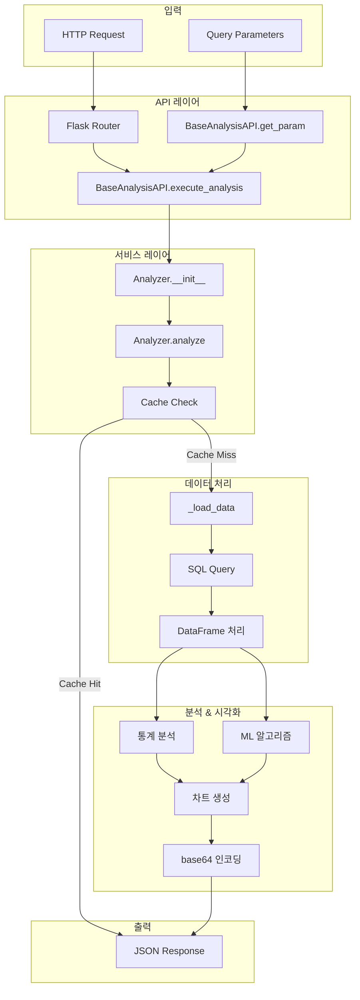
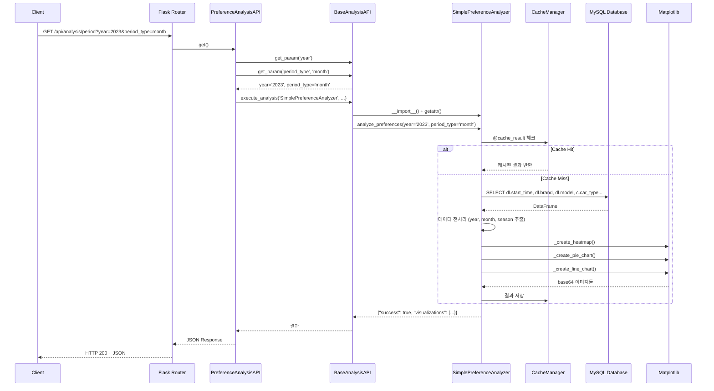
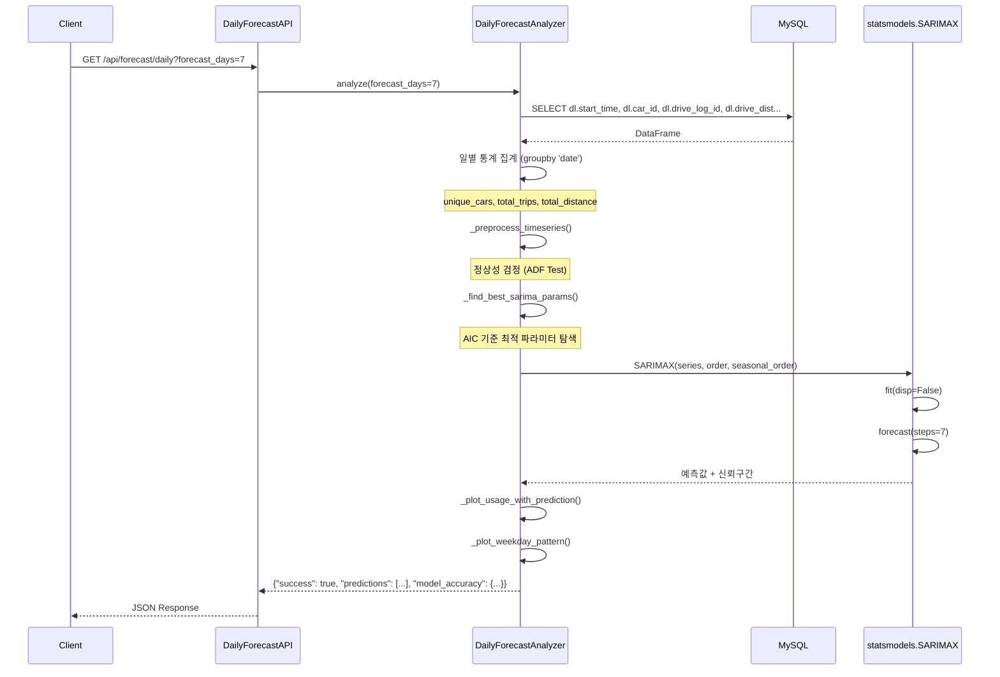
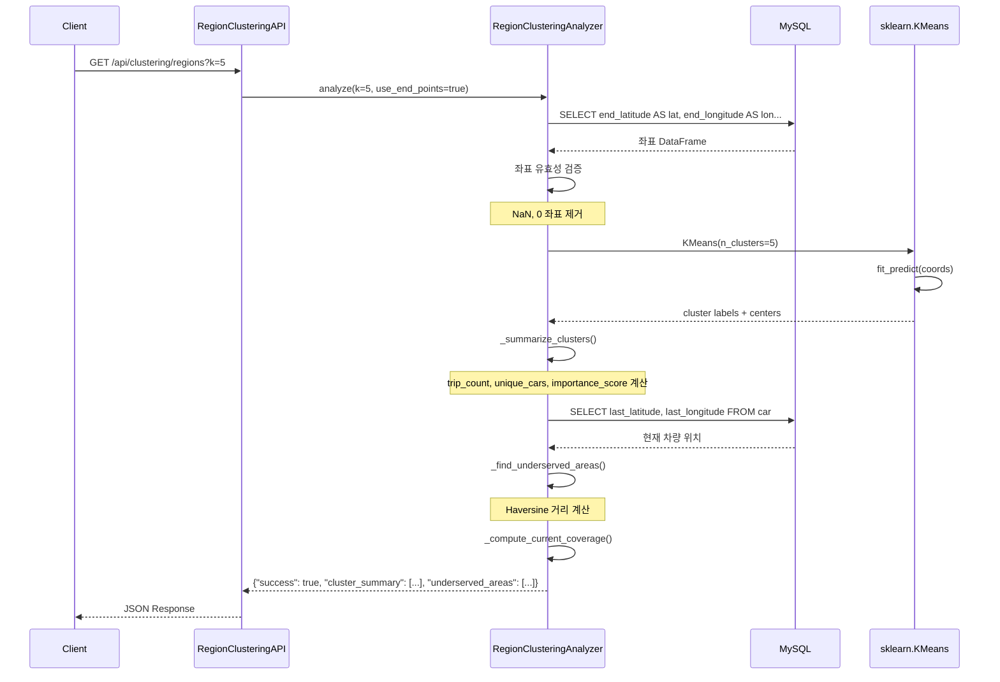
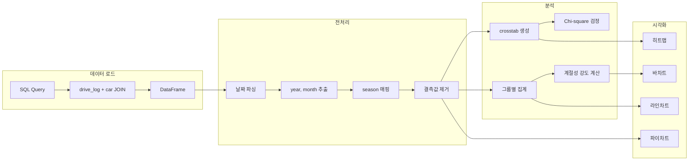
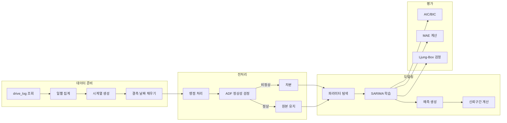
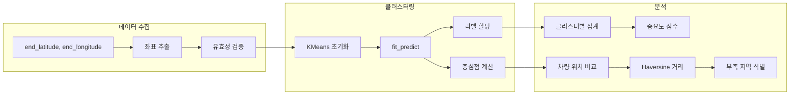
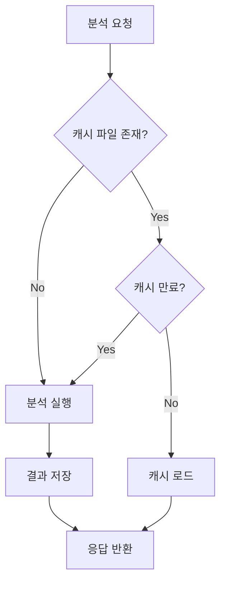
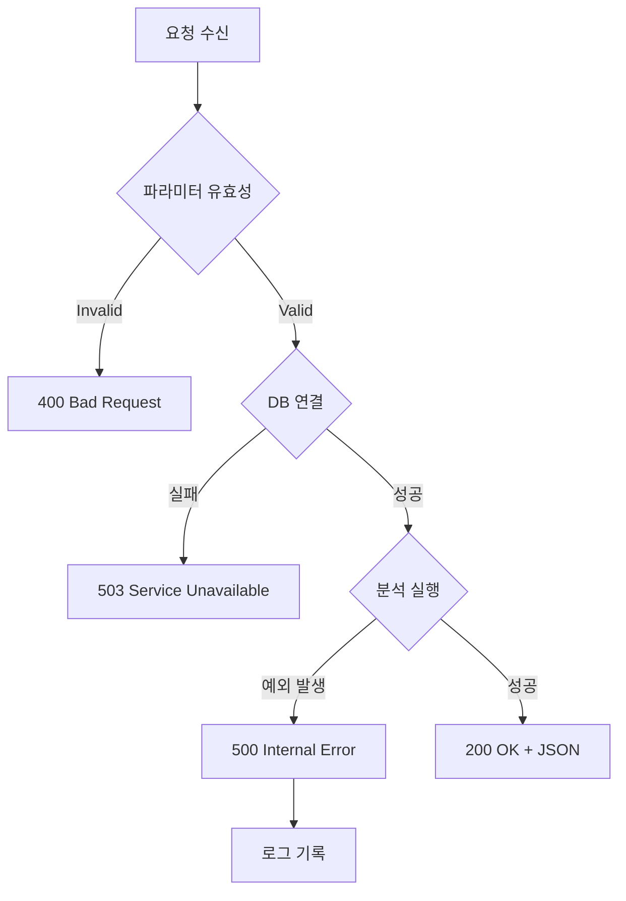

# 데이터 흐름

> KUNI 2thecore 데이터 분석 시스템의 요청 처리 흐름 및 데이터 파이프라인

## 전체 데이터 흐름 개요



## 요청 처리 시퀀스

### 1. 선호도 분석 요청 흐름



### 2. 일별 예측 요청 흐름



### 3. 지역 클러스터링 요청 흐름



## 데이터 처리 파이프라인

### 선호도 분석 파이프라인



### SARIMA 예측 파이프라인



### K-means 클러스터링 파이프라인



## 데이터베이스 쿼리 패턴

### 선호도 분석 쿼리
**위치**: [simple_preference_analysis.py:95-103](../src/simple_preference_analysis.py#L95-L103)

```sql
SELECT dl.start_time, dl.brand, dl.model, c.car_type
FROM drive_log dl
JOIN car c ON dl.car_id = c.car_id
WHERE dl.start_time IS NOT NULL
  AND YEAR(dl.start_time) = {year}  -- 선택적
```

### 트렌드 분석 쿼리
**위치**: [simple_trend_analysis.py:72-84](../src/simple_trend_analysis.py#L72-L84)

```sql
SELECT
    YEAR(dl.start_time) as drive_year,
    dl.brand,
    dl.model,
    c.car_year,
    COUNT(*) as drive_count
FROM drive_log dl
JOIN car c ON dl.car_id = c.car_id
WHERE YEAR(dl.start_time) BETWEEN {start_year} AND {end_year}
GROUP BY YEAR(dl.start_time), dl.brand, dl.model, c.car_year
ORDER BY drive_year, dl.brand
```

### 일별 예측 쿼리
**위치**: [daily_forecast.py:106-114](../src/services/daily_forecast.py#L106-L114)

```sql
SELECT
    dl.start_time,
    dl.car_id,
    dl.drive_log_id,
    dl.drive_dist
FROM drive_log dl
WHERE dl.start_time IS NOT NULL
  AND DATE(dl.start_time) >= '{start_date}'
  AND DATE(dl.start_time) <= '{end_date}'
```

### 클러스터링 쿼리 (도착점 기준)
**위치**: [region_clustering.py:118-126](../src/services/region_clustering.py#L118-L126)

```sql
SELECT
    dl.end_latitude AS lat,
    dl.end_longitude AS lon,
    dl.start_latitude,
    dl.start_longitude,
    dl.start_point,
    dl.end_point,
    dl.drive_dist,
    dl.car_id
FROM drive_log dl
WHERE dl.start_time IS NOT NULL
  AND dl.end_latitude IS NOT NULL
  AND dl.end_longitude IS NOT NULL
```

## 응답 데이터 형식

### 성공 응답 구조
```json
{
    "success": true,
    "message": "분석이 완료되었습니다.",
    "visualizations": {
        "chart_name": "data:image/jpeg;base64,/9j/4AAQSkZ..."
    },
    "data": { ... }  // 분석별 추가 데이터
}
```

### 시각화 데이터 흐름
```mermaid
flowchart LR
    A[matplotlib Figure] --> B[savefig to BytesIO]
    B --> C[buffer.seek(0)]
    C --> D[base64.b64encode]
    D --> E["data:image/jpeg;base64,{encoded}"]
    E --> F[JSON Response]
```

**코드 참조**: [simple_preference_analysis.py:290-298](../src/simple_preference_analysis.py#L290-L298)

```python
def _fig_to_base64(self, fig) -> str:
    buffer = io.BytesIO()
    fig.savefig(buffer, format='jpeg', dpi=75, bbox_inches='tight')
    buffer.seek(0)
    image_base64 = base64.b64encode(buffer.read()).decode('utf-8')
    plt.close(fig)
    return f"data:image/jpeg;base64,{image_base64}"
```

## 캐싱 메커니즘

### 캐시 키 생성
**위치**: [cache.py:12-14](../src/utils/cache.py#L12-L14)

```python
cache_key = f"{func.__name__}_{hash(str(args) + str(kwargs))}"
# 예: "analyze_5842674930928"
```

### 캐시 흐름


### 캐시 파일 구조
```
cache/
├── analyze_5842674930928.pkl      # 선호도 분석 결과
├── analyze_yearly_trend_...pkl    # 트렌드 분석 결과
├── analyze_1234567890.pkl         # 일별 예측 결과
└── analyze_9876543210.pkl         # 클러스터링 결과
```

## 에러 처리 흐름



### 에러 응답 형식
```json
{
    "success": false,
    "message": "분석 중 오류가 발생했습니다: {error_detail}",
    "visualizations": {}
}
```

---

**관련 문서**: [[Architecture]] | [[API-Reference]] | [[Diagrams]]
