# 다이어그램 모음

> KUNI 2thecore 데이터 분석 시스템의 Mermaid 다이어그램 컬렉션

## 시스템 아키텍처

### 전체 시스템 구조

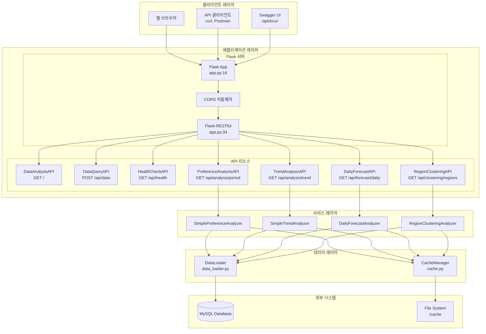

### 컴포넌트 관계도

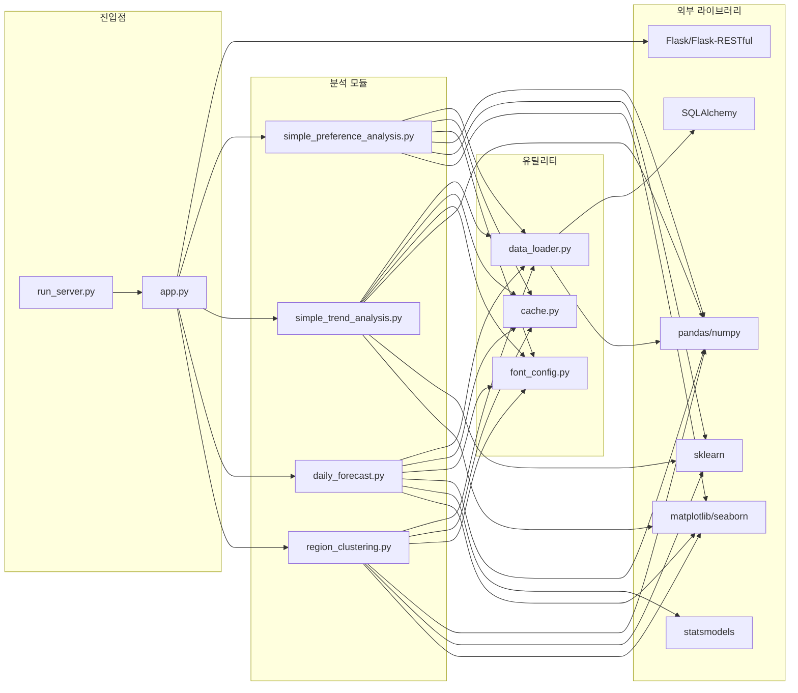

---

## 클래스 다이어그램

### API 클래스 계층 구조

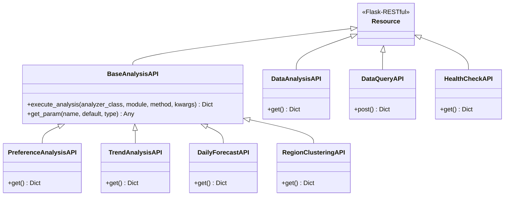

### Analyzer 클래스 구조

```mermaid
classDiagram
    class SimplePreferenceAnalyzer {
        -brand_colors: Dict~str, str~
        -dynamic_colors: Dict~str, str~
        -color_palette: List~str~
        -season_names: Dict~int, str~
        +analyze_preferences(year, period_type) Dict
        -_load_data(year) DataFrame
        -_create_all_charts(df, period_type) Dict
        -_create_heatmap(df, period_type) str
        -_create_pie_chart(df) str
        -_create_line_chart(df, period_type) str
        -_create_seasonality_chart(df) str
        -_create_statistical_chart(df, period_type) str
        -_color_for_brand(brand) str
        -_fig_to_base64(fig) str
    }

    class SimpleTrendAnalyzer {
        -brand_colors: Dict~str, str~
        -current_year: int
        +analyze_yearly_trend(start_year, end_year, top_n) Dict
        -_load_trend_data(start, end) DataFrame
        -_analyze_trends(df, top_n) Dict
        -_analyze_brand_trends(df) Dict
        -_analyze_model_trends(df, n) Dict
        -_analyze_car_age_trends(df) Dict
        -_analyze_market_share_evolution(df) Dict
        -_create_trend_charts(df, results, n) Dict
    }

    class DailyForecastAnalyzer {
        -max_forecast_days: int
        +analyze(start_date, end_date, forecast_days) Dict
        -_load_data(start, end) DataFrame
        -_forecast_sarima(stats, days) Tuple
        -_preprocess_timeseries(series) Tuple
        -_find_best_sarima_params(series) Tuple
        -_fallback_arima_forecast(series, days) Tuple
        -_plot_usage_with_prediction(stats, forecast) str
        -_plot_weekday_pattern(pattern) str
    }

    class RegionClusteringAnalyzer {
        -default_k: int
        +analyze(start, end, k, use_end, method, min_trips, eps, threshold) Dict
        -_load_data(start, end, use_end) DataFrame
        -_compute_dbscan_centers(df) DataFrame
        -_summarize_clusters(df, centers, min) Tuple
        -_load_car_locations() List
        -_haversine_km(lat1, lon1, lat2, lon2) float
        -_find_underserved_areas(centers, cars, threshold) List
        -_compute_current_coverage(centers, cars, threshold) Dict
        -_plot_clusters(df, centers) str
        -_plot_recommendations(centers, underserved) str
    }
```

---

## 시퀀스 다이어그램

### 선호도 분석 요청 흐름

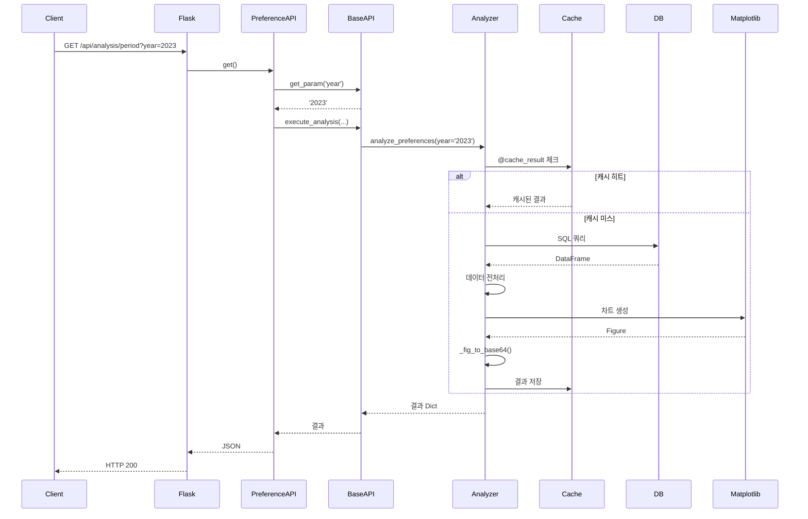

### SARIMA 예측 흐름

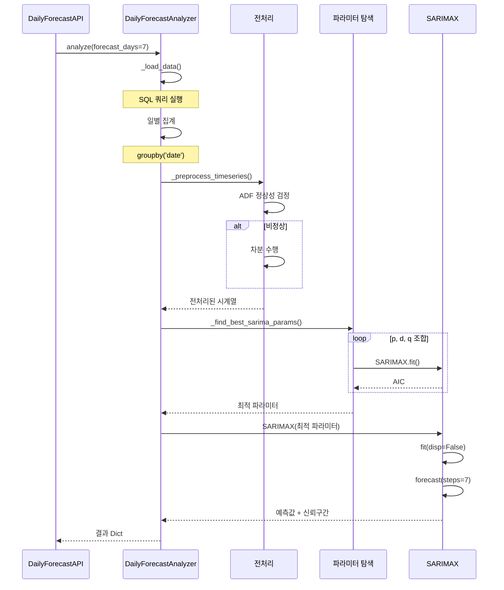

### K-means 클러스터링 흐름

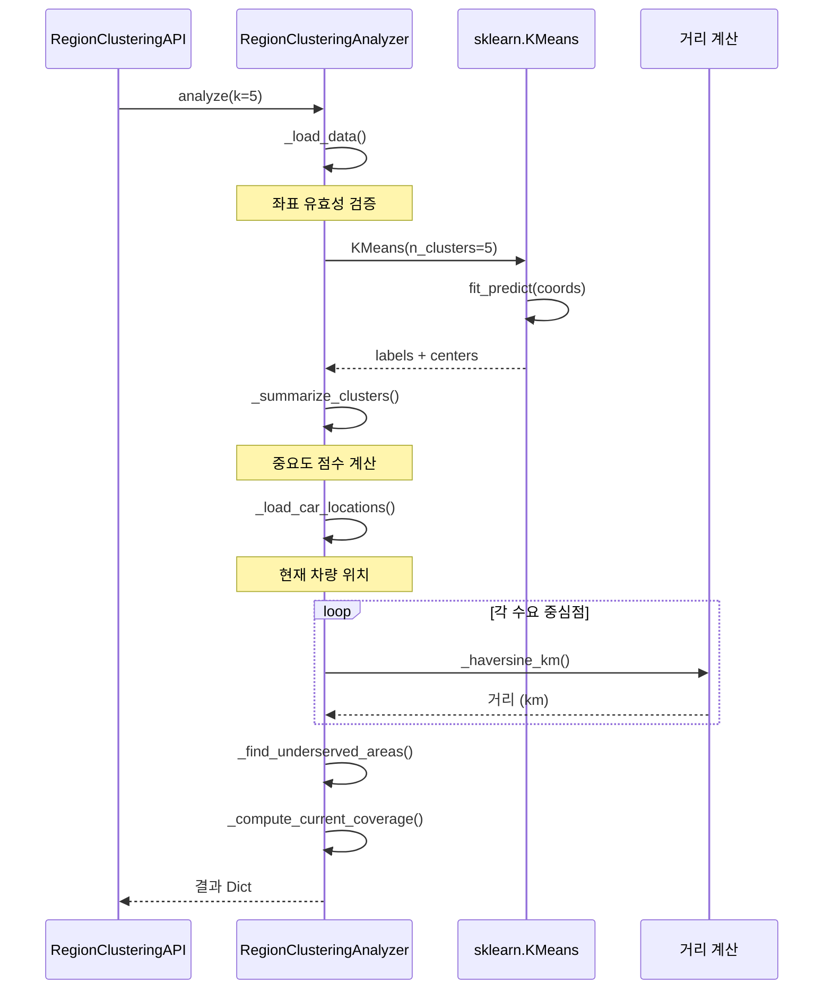

---

## 데이터 흐름 다이어그램

### 전체 데이터 파이프라인

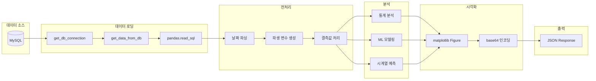

### 캐시 메커니즘

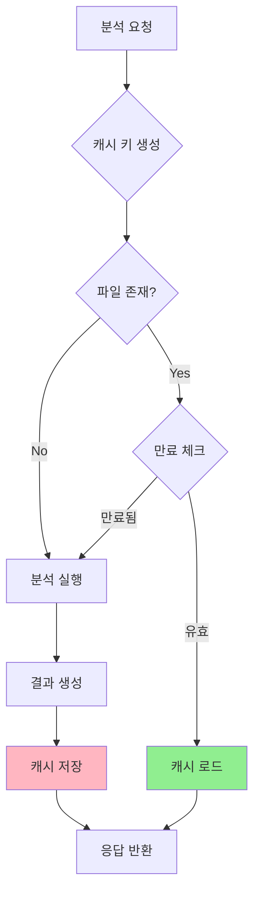

---

## 데이터베이스 ER 다이어그램

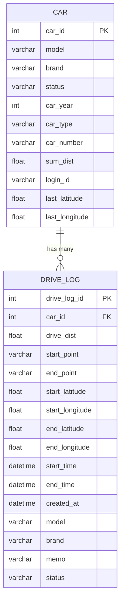

---

## 배포 아키텍처

### 개발 환경

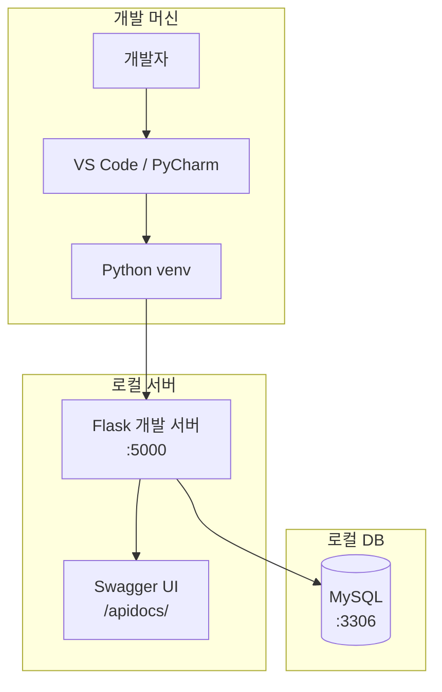

### 프로덕션 환경

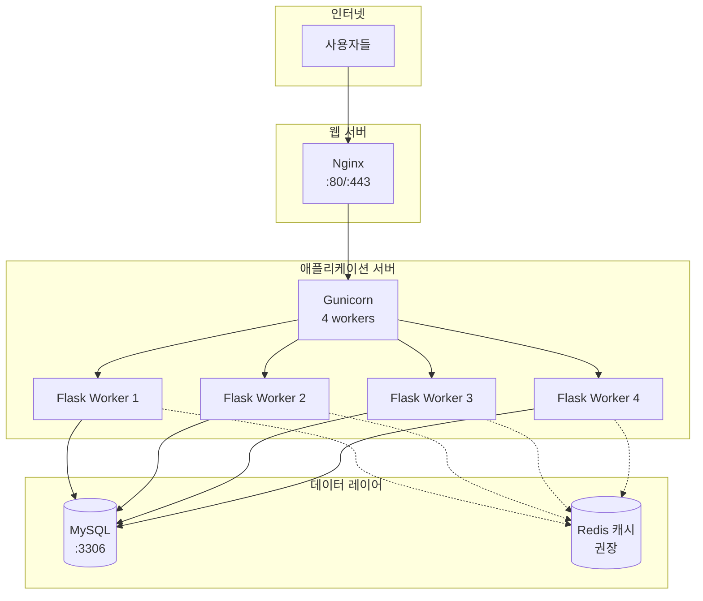

---

## 상태 다이어그램

### 분석 요청 상태

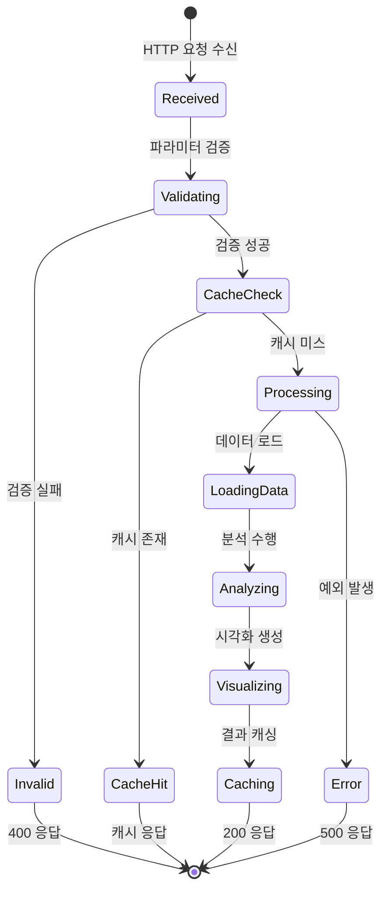

---

## 사용법

### Mermaid 렌더링

GitHub Wiki는 Mermaid 다이어그램을 자동으로 렌더링합니다. 아래와 같이 코드 블록을 사용하세요:

````markdown
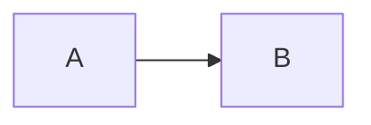
````

### 로컬 렌더링

Mermaid CLI를 사용하여 이미지로 변환할 수 있습니다:

```bash
npm install -g @mermaid-js/mermaid-cli
mmdc -i diagram.mmd -o diagram.png
```

---

**관련 문서**: [[Architecture]] | [[Data-Flow]] | [[API-Reference]]
