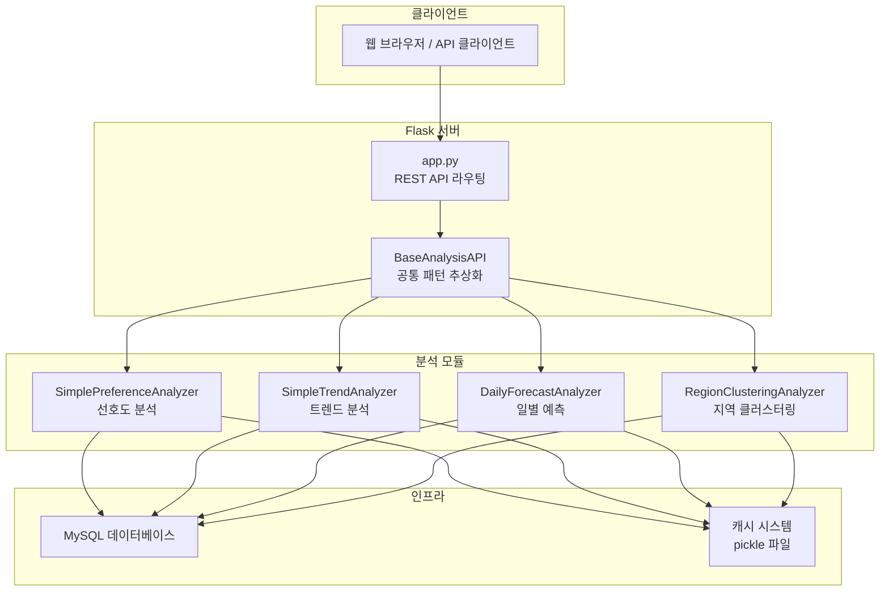

# KUNI 2thecore 데이터 분석 시스템

> 렌터카 회사를 위한 데이터 기반 비즈니스 인사이트 플랫폼

## 프로젝트 개요

KUNI 2thecore 데이터 분석 시스템은 렌터카 회사의 차량 운행 데이터를 분석하여 비즈니스 인사이트를 제공하는 Flask 기반 REST API 서버입니다.

### 핵심 기능

| 기능 | 설명 | 엔드포인트 |
|------|------|------------|
| **계절별 선호도 분석** | 월별/계절별 브랜드 및 차량 선호도 패턴 분석 | `GET /api/analysis/period` |
| **연도별 트렌드 분석** | 연간 브랜드 선호도 변화 추세 분석 | `GET /api/analysis/trend` |
| **일별 운행량 예측** | SARIMA 시계열 모델 기반 운행량 예측 | `GET /api/forecast/daily` |
| **지역 클러스터링** | K-means/DBSCAN 기반 최적 렌터카 위치 분석 | `GET /api/clustering/regions` |

## 시스템 아키텍처



## 기술 스택

### 백엔드
- **웹 프레임워크**: Flask 3.1, Flask-RESTful 0.3
- **API 문서화**: Flasgger (Swagger UI)
- **데이터베이스**: MySQL + SQLAlchemy 2.0

### 데이터 분석
- **데이터 처리**: Pandas 2.3, NumPy 2.3
- **머신러닝**: scikit-learn 1.7 (K-means, DBSCAN, LinearRegression)
- **시계열 분석**: statsmodels 0.14 (SARIMA, ARIMA)
- **통계 분석**: SciPy 1.16

### 시각화
- **차트 생성**: Matplotlib 3.10, Seaborn 0.13
- **한글 지원**: 크로스 플랫폼 한글 폰트 자동 설정

## 퀵 스타트

### 1. 환경 설정
```bash
# 저장소 클론
git clone https://github.com/your-org/KUNI_2thecore_data_analysis.git
cd KUNI_2thecore_data_analysis

# 가상환경 생성 및 활성화
python -m venv .venv
source .venv/bin/activate  # Windows: .venv\Scripts\activate

# 의존성 설치
pip install -r requirements.txt
```

### 2. 데이터베이스 설정
```bash
# .env 파일 생성
cat > .env << EOF
DB_HOST=your_mysql_host
DB_USER=your_mysql_user
DB_PASSWORD=your_mysql_password
DB_NAME=your_database_name
DB_PORT=3306
EOF
```

### 3. 서버 실행
```bash
# 개발 서버 실행
python run_server.py

# 서버 접속
# API: http://localhost:5000
# Swagger: http://localhost:5000/apidocs/
```

### 4. API 테스트
```bash
# 헬스 체크
curl http://localhost:5000/api/health

# 선호도 분석
curl http://localhost:5000/api/analysis/period

# 트렌드 분석
curl http://localhost:5000/api/analysis/trend
```

## 프로젝트 구조

```
KUNI_2thecore_data_analysis/
├── app.py                      # Flask 애플리케이션 진입점
├── run_server.py               # 서버 실행 스크립트
├── verify_setup.py             # 환경 검증 스크립트
├── requirements.txt            # Python 의존성
├── .env                        # 환경 변수 (git 제외)
│
├── src/
│   ├── data_loader.py          # DB 연결 및 데이터 로딩
│   ├── simple_preference_analysis.py   # 선호도 분석
│   ├── simple_trend_analysis.py        # 트렌드 분석
│   │
│   ├── services/
│   │   ├── daily_forecast.py   # 일별 예측 서비스
│   │   └── region_clustering.py # 지역 클러스터링 서비스
│   │
│   └── utils/
│       ├── cache.py            # 결과 캐싱 유틸리티
│       └── font_config.py      # 한글 폰트 설정
│
├── tests/                      # 테스트 코드
├── cache/                      # 캐시 파일 저장소
└── wiki/                       # 프로젝트 문서
```

## 문서 목차

### 아키텍처 & 설계
- [[Architecture|Architecture]] - 시스템 아키텍처 및 컴포넌트 구조
- [[Data-Flow|Data-Flow]] - 데이터 처리 흐름 및 시퀀스 다이어그램
- [[Diagrams|Diagrams]] - Mermaid 다이어그램 모음

### 모듈 가이드
- [[Module-Preference-Analysis|Module-Preference-Analysis]] - 선호도 분석 모듈
- [[Module-Trend-Analysis|Module-Trend-Analysis]] - 트렌드 분석 모듈
- [[Module-Daily-Forecast|Module-Daily-Forecast]] - 일별 예측 모듈
- [[Module-Region-Clustering|Module-Region-Clustering]] - 지역 클러스터링 모듈

### API & 운영
- [[API-Reference|API-Reference]] - REST API 레퍼런스
- [[Getting-Started|Getting-Started]] - 설치 및 설정 가이드
- [[Deployment|Deployment]] - 배포 가이드

## 데이터베이스 스키마

### car 테이블
| 컬럼 | 타입 | 설명 |
|------|------|------|
| `car_id` | PK | 차량 고유 식별자 |
| `model` | VARCHAR | 차량 모델 (K3, 투싼 등) |
| `brand` | VARCHAR | 제조사 (기아, 현대, 제네시스) |
| `status` | VARCHAR | 상태 (IDLE, MAINTENANCE) |
| `car_year` | INT | 제조 연도 |
| `car_type` | VARCHAR | 차량 유형 (소형, 중형, 대형, SUV) |
| `last_latitude` | FLOAT | 현재 GPS 위도 |
| `last_longitude` | FLOAT | 현재 GPS 경도 |

### drive_log 테이블
| 컬럼 | 타입 | 설명 |
|------|------|------|
| `drive_log_id` | PK | 운행 기록 식별자 |
| `car_id` | FK | 차량 참조 |
| `drive_dist` | FLOAT | 운행 거리 (km) |
| `start_point` | VARCHAR | 출발 위치명 |
| `end_point` | VARCHAR | 도착 위치명 |
| `start_time` | DATETIME | 출발 시간 |
| `end_time` | DATETIME | 도착 시간 |
| `start_latitude` | FLOAT | 출발 GPS 위도 |
| `start_longitude` | FLOAT | 출발 GPS 경도 |
| `end_latitude` | FLOAT | 도착 GPS 위도 |
| `end_longitude` | FLOAT | 도착 GPS 경도 |

## 라이선스

이 프로젝트는 내부 비즈니스 분석 용도로 개발되었습니다.

---

**최종 업데이트**: 2024년 11월
